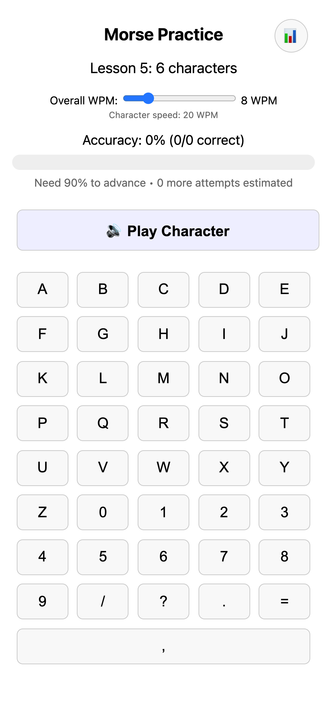
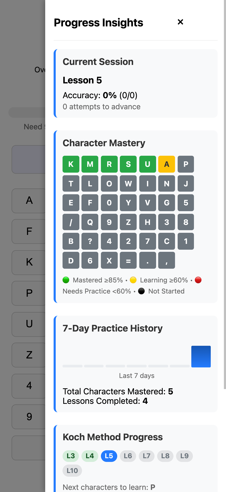

# Learn Morse

Project to create a simple web app to learn Morse code using Koch method

Vincent Bruijn

## Overview

This is a single-file web application that implements the Koch method for learning Morse code. The Koch method is a proven approach that starts with just two characters and gradually adds more as the student achieves proficiency.

## Features

- **Progressive Learning**: 40+ lessons following the Koch method sequence, starting with K and M
- **Farnsworth Timing**: Characters played at 20 WPM with adjustable overall speed (5-20 WPM) for proper learning
- **Individual Character Tracking**: Color-coded keyboard shows accuracy for each character (green=good, yellow=medium, red=needs practice)
- **Progress Tracking**: Visual progress bar and statistics showing accuracy and estimated attempts needed
- **Progress Insights Drawer**: Mobile-first slide-out drawer with detailed learning analytics, character mastery grid, 7-day practice history, and lesson roadmap
- **Session History**: Automatic saving of practice sessions to localStorage
- **Audio Generation**: Real-time Morse code audio using Web Audio API at 600Hz
- **Character Mixing**: Mixes 70% current lesson characters with 30% review characters from previous lessons
- **Progress Reset**: Option to completely reset all progress and start fresh

## How It Works

1. **Lesson Structure**: Each lesson introduces new characters while maintaining previous ones
2. **Practice Flow**: Click "Play Character" to hear a random character, then guess using the keyboard
3. **Advancement**: Achieve 90% accuracy to unlock the next lesson
4. **Persistence**: All progress, settings, and statistics are saved locally in the browser

The app uses no external dependencies and works entirely offline once loaded.

## Screenshots

