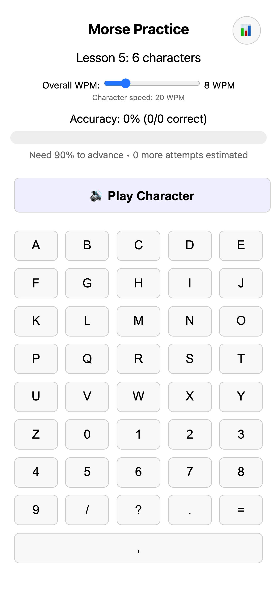
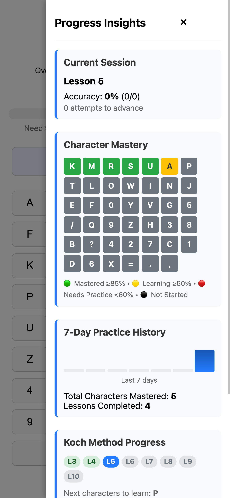

# Learn Morse

Project to create a simple web app to learn Morse code using Koch method

Vincent Bruijn

## Overview

This is a single-file web application that implements the Koch method for learning Morse code. The Koch method is a proven approach that starts with just two characters and gradually adds more as the student achieves proficiency.

## Features

- **Progressive Learning**: 40+ lessons following the Koch method sequence, starting with K and M
- **Farnsworth Timing**: Characters played at 20 WPM with adjustable overall speed (5-20 WPM) for proper learning
- **Individual Character Tracking**: Color-coded keyboard shows accuracy for each character (green=good, yellow=medium, red=needs practice)
- **Progress Tracking**: Visual progress bar and statistics showing accuracy and estimated attempts needed
- **Progress Insights Drawer**: Mobile-first slide-out drawer with detailed learning analytics, character mastery grid, 7-day practice history, and lesson roadmap
- **Session History**: Automatic saving of practice sessions to localStorage
- **Audio Generation**: Real-time Morse code audio using Web Audio API at 600Hz
- **Character Mixing**: Mixes 70% current lesson characters with 30% review characters from previous lessons
- **Progress Reset**: Option to completely reset all progress and start fresh
- **Learn View**: A second view that explains the code visually, complementing the audio drill — a dichotomic tree, a one-column A–Z table, a patterns view (mirrors, palindromes, dit/dah flips, families, the digit rule), and a rhythm view drawn to real duration. Every character on the page is tappable to hear it.

## The Learn View

Practice is deliberately audio-only: characters are never shown during a lesson. The **Learn** tab is the counterpart to that — the whole code, laid out four ways, for when you want to reason about it rather than react to it.

1. **Tree** — the dichotomic tree, growing left to right. A dit takes the upper branch, a dah the lower one, so every character is a path from the root. Tapping a character plays it and lights up its path.
2. **A–Z** — one column, reading order, each code drawn to scale. A reference you can scan.
3. **Patterns** — Morse as a system rather than a list: mirror pairs (A/N, D/U), palindromes, dit/dah flips (E/T, S/O), the two element families (E I S H 5 and T M O ∅ 0), and the counting rule behind the ten digits.
4. **Rhythm** — each character as a proportional timeline (dit = 1 unit, dah = 3, gap = 1), so the drawing matches what the ear actually receives. Sortable by table order, by length, or by your current lesson.

Characters in your current lesson are marked in green throughout.

## How It Works

1. **Lesson Structure**: Each lesson introduces new characters while maintaining previous ones
2. **Practice Flow**: Click "Play Character" to hear a random character, then guess using the keyboard
3. **Advancement**: Achieve 90% accuracy to unlock the next lesson
4. **Persistence**: All progress, settings, and statistics are saved locally in the browser

The app uses no external dependencies and works entirely offline once loaded.

## iOS Safari Audio Setup

When using the app on iOS devices (iPhone/iPad) with Safari:

1. **First-time setup**: Tap the "Enable Sound" button that appears on first load
2. **Check ringer switch**: Ensure the physical ringer switch on the side of your device is ON (not in silent mode)
3. **Check volume**: Make sure your device volume is turned up using the volume buttons

iOS Safari requires explicit user interaction to enable Web Audio, and the device must not be in silent mode for sounds to play.

## Screenshots

